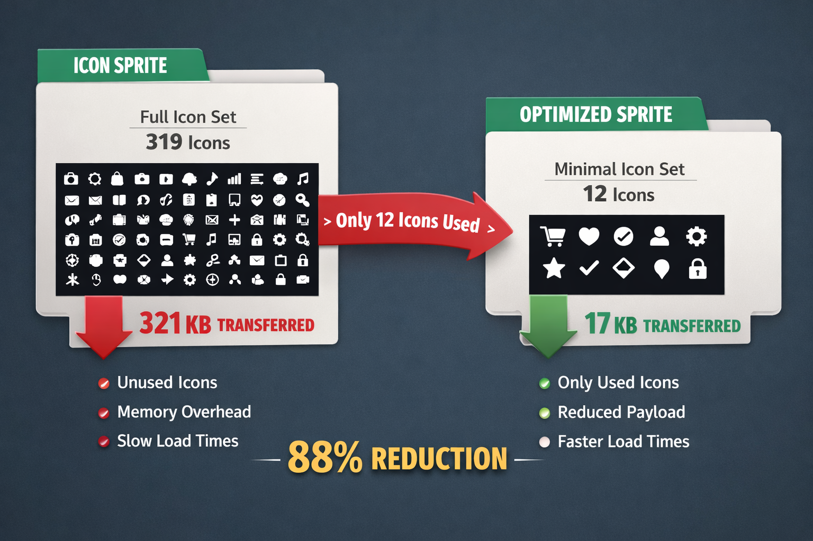

# mf-toolkit

[](./LICENSE)
[](https://nodejs.org)

Modular **build-time optimization tools** for microfrontend architectures. Tree-shake what bundlers can't — SVG sprites, shared assets, runtime overhead. Each package works independently.

---

## Packages

### 🎯 SVG Sprite Optimization — [@mf-toolkit/sprite-plugin](./packages/sprite-plugin)

[](https://www.npmjs.com/package/@mf-toolkit/sprite-plugin)




**Your design system has 500 icons. Your microfrontend uses 12. Why ship all of them?**

A webpack plugin (and standalone tool) that statically analyzes your source code, detects which SVG icons are actually imported, and generates an optimized sprite containing only those icons. Like tree-shaking, but for SVG sprites.

⚡ **88% bundle reduction** tested on a production app — 319 icons in design system → 38 actually used

```bash
npm install @mf-toolkit/sprite-plugin --save-dev
```

```js
// webpack.config.js — 4 lines to optimize your icon bundle
new MfSpriteWebpackPlugin({
  iconsDir: './src/assets/icons',
  sourceDirs: ['./src'],
  importPattern: /@my-ui\/icons\/(.+)/,
  output: './src/generated/sprite.ts',
});
```

**What it does:**

- 🔍 Scans all import patterns — static, dynamic `import()`, `require()`, `React.lazy`, `.then()` destructuring
- 🧠 Smart name matching — `ChevronRight` → `chevron-right.svg`, `Coupon2` → `coupon-2.svg`
- ⚙️ SVG optimization via [SVGO](https://github.com/svg/svgo) — strips metadata, replaces hardcoded colors with `currentColor`
- 🔒 ID collision protection — auto-prefixes internal SVG IDs to prevent gradient/mask conflicts
- 🔌 Pluggable parsers — regex (zero deps), TypeScript Compiler API, or Babel — your choice
- 📊 Build manifest for CI — JSON report of which icons were included/missing

> **Zero analyzer dependencies by default.** Regex-based parsing keeps install at **17 KB**. Need full AST accuracy? Opt into `parser: 'typescript'` or `parser: 'babel'` — loaded dynamically, zero cost if unused.

[](./packages/sprite-plugin)

---

### 🔬 MF Shared Dependency Analyser — [@mf-toolkit/shared-inspector](./packages/shared-inspector)

[](https://www.npmjs.com/package/@mf-toolkit/shared-inspector)
[](https://nodejs.org)

**Your `shared` config is wrong — and you don't know it yet.**

Module Federation teams manually manage `shared` dependencies and silently ship 10× React, broken singleton chains, and ghost packages that couple independent teams for no reason.

`shared-inspector` is a build-time analyser that catches these mistakes before they reach production — both per-project and across the entire federation:

- 🗑️ **Over-sharing** — packages declared in `shared` that no file actually imports
- 📦 **Under-sharing** — packages used by host and remote but missing from `shared` (each MF bundles its own copy)
- ⚠️ **Version mismatch** — `requiredVersion` doesn't satisfy installed version → silent fallback to local bundle → "Invalid hook call" in prod
- 🔗 **Cross-MF conflicts** — version ranges with no overlap, inconsistent singleton flags, ghost shares, host gaps

```bash
npm install @mf-toolkit/shared-inspector --save-dev
```

```ts
// Webpack plugin — sharedConfig auto-extracted from ModuleFederationPlugin, no duplication
new MfSharedInspectorPlugin({
  sourceDirs: ['./src'],
  warn: true,
  writeManifest: true, // writes project-manifest.json per MF
});

// Programmatic API — per-project analysis
import { buildProjectManifest, analyzeProject, analyzeFederation } from '@mf-toolkit/shared-inspector';

const manifest = await buildProjectManifest({
  name: 'checkout',
  sourceDirs: ['./src'],
  sharedConfig: { react: { singleton: true, requiredVersion: '^18.0.0' }, lodash: {} },
});
const report = analyzeProject(manifest);
// report.unused     → [{ package: 'lodash', singleton: false }]
// report.mismatched → [{ package: 'react', configured: '^18.0.0', installed: '18.3.1' }]

// Cross-MF federation analysis
const fedReport = analyzeFederation([checkoutManifest, catalogManifest, cartManifest]);
// fedReport.versionConflicts → [{ package: 'react', versions: { checkout: '^17', catalog: '^18' } }]
// fedReport.ghostShares      → [{ package: 'lodash', sharedBy: 'cart', usedUnsharedBy: [] }]
```

**What it does:**

- 🔍 Two scan depths — `direct` (fast) and `local-graph` (follows barrel re-exports recursively)
- 🧠 Detects packages hidden behind `export { X } from 'pkg'` chains that direct-mode tools miss
- 🔌 Webpack plugin — auto-extracts `shared` from `ModuleFederationPlugin`, optionally fails the build (`failOn: 'mismatch'`)
- 📊 Build manifest for CI — each MF writes `project-manifest.json`, then `analyzeFederation()` aggregates N manifests for cross-team analysis

[](./packages/shared-inspector)

---

## Philosophy

- ⚡ **Build-time over runtime.** Optimize at build, ship less to the browser.
- 📦 **Use what you need.** Every package is published independently to npm. No forced coupling.
- 🪶 **Minimal dependencies.** Zero deps by default. No glob libraries — just the Node.js standard library.

## Keywords

`microfrontend` `svg sprite` `webpack plugin` `icon optimization` `tree shaking icons` `bundle size` `svg optimization` `build tools` `static analysis` `micro frontend`

## License

MIT
