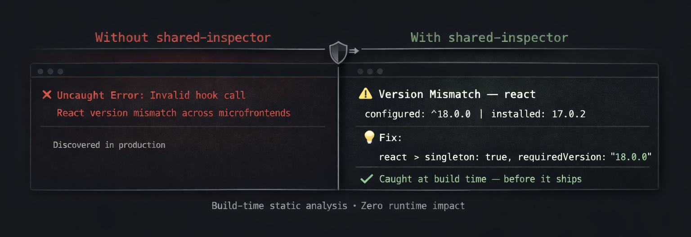
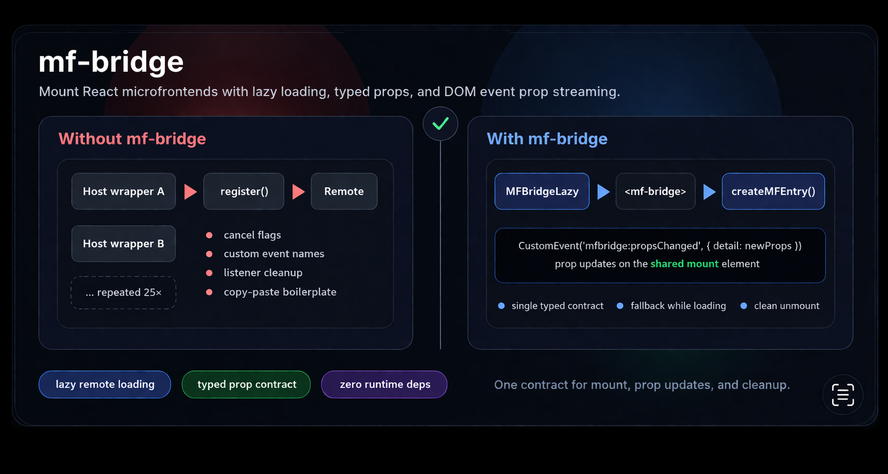
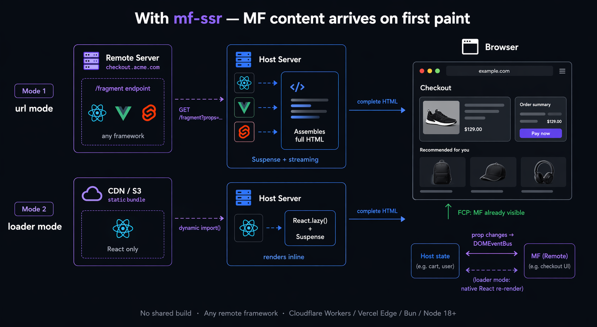

# mf-toolkit

[](./LICENSE)
[](https://nodejs.org)

A modular collection of build-time and runtime tools for microfrontend architectures. Each package works independently and is published separately to npm.

---

## Packages

### 🔬 MF Shared Inspector — [@mf-toolkit/shared-inspector](./packages/shared-inspector)

[](https://www.npmjs.com/package/@mf-toolkit/shared-inspector)
[](https://nodejs.org)



**Validate Module Federation `shared` config before it reaches runtime.**

A build-time analyzer that detects version mismatches, singleton gaps, over-sharing, and under-sharing in your MF `shared` config. Supports federation-level analysis across multiple microfrontends via manifest aggregation.

```bash
npm install @mf-toolkit/shared-inspector --save-dev
```

**What it does:**

- 🔍 **Detects** version mismatches, singleton gaps, over-sharing, and under-sharing
- 🔗 **Federation analysis** — aggregates manifests across microfrontends, catches cross-app conflicts
- 📊 **Risk scoring** — every finding ranked by severity with actionable fix suggestions
- 🔌 **Webpack plugin** — extracts `shared` config at build time, optionally fails the build
- 📋 **JSON output** — machine-readable report for CI/CD integration

[](./packages/shared-inspector)
[](https://github.com/zvitaly7/mf-storefront-demo)

---

### 🌉 MF Bridge — [@mf-toolkit/mf-bridge](./packages/mf-bridge)

[](https://www.npmjs.com/package/@mf-toolkit/mf-bridge)
[](https://react.dev)



**Mount a microfrontend React component into a host shell — with lazy loading, automatic prop streaming, and a typed fallback.**

Replaces the repetitive `moved_to_mf_*` wrapper pattern. Instead of copy-pasting 15–20 lines of mount/unmount/event boilerplate for every remote component, define the contract once and let the bridge handle the lifecycle.

```bash
npm install @mf-toolkit/mf-bridge
```

```tsx
// Remote side (inside your MF, exposed via Module Federation)
import { createMFEntry } from '@mf-toolkit/mf-bridge/entry'
export const register = createMFEntry(CheckoutWidget)

// Host side (inside your shell app)
import { MFBridgeLazy } from '@mf-toolkit/mf-bridge'

<MFBridgeLazy
  register={() => import('checkout/entry').then(m => m.register)}
  props={{ orderId, user }}          // type-inferred from register
  fallback={<LocalCheckout />}
/>
```

**What it does:**

- 🔗 **Type-safe contract** — props type is inferred end-to-end from the remote's `register` export; TypeScript catches mismatches at compile time
- 📡 **Prop streaming** — prop updates are delivered to the mounted remote component via DOM `CustomEvent`s on the shared mount-point element; no shared module state, no React context crossing bundle boundaries
- ⏳ **Lazy loading** — `MFBridgeLazy` resolves the remote module asynchronously and shows a fallback while loading
- 🛡️ **Error handling** — `onError` callback for load failures; component stays on fallback if the remote is unavailable
- 🧹 **Clean lifecycle** — mount, re-render on prop change, and unmount are all handled; no leaked listeners

> **Zero production dependencies.** Prop streaming uses the native `CustomEvent` API. React 18–20 peer dep.

[](./packages/mf-bridge)

---

### 🌐 MF SSR — [@mf-toolkit/mf-ssr](./packages/mf-ssr)

[](https://www.npmjs.com/package/@mf-toolkit/mf-ssr)
[](https://react.dev)
[](https://nodejs.org)



**MF content on first paint — SSR for microfrontends without a shared build.**

Each remote team deploys their own server (or static bundle). `mf-ssr` fetches the remote's HTML during SSR and inlines it into the host response. On the client, host state changes stream to the remote via `DOMEventBus` — no re-fetch, no layout shift, no blank MF slot in crawlers.

```bash
npm install @mf-toolkit/mf-ssr
```

```tsx
// Remote side — expose a fragment endpoint (Hono, Next.js Route Handler, Bun, CF Worker…)
import { createMFReactFragment } from '@mf-toolkit/mf-ssr/fragment'
export const GET = createMFReactFragment(CheckoutWidget)

// Host side — drop it in your React tree like any component
import { MFBridgeSSR } from '@mf-toolkit/mf-ssr'

<MFBridgeSSR
  url="https://checkout.acme.com/fragment"
  namespace="checkout"
  props={{ orderId, step }}
  fallback={<CheckoutSkeleton />}
  onEvent={(type) => { if (type === 'completed') goToConfirmation() }}
/>
```

**What it does:**

- 🖥️ **Zero-JS first paint** — remote HTML arrives inline in the host SSR stream; no client-side MF slot flash or layout shift
- 📡 **Prop streaming** — host state changes reach the remote via `DOMEventBus` after hydration; no re-fetch
- 🏗️ **No shared build** — each team owns their own server and bundle; host fetches plain HTTP
- 🌐 **Any remote framework** — `url` mode works with React, Vue, Svelte, or vanilla; `loader` mode for React-on-CDN remotes
- ⚡ **Edge-native** — Web Streams API only; runs on Cloudflare Workers, Vercel Edge, Bun, and Node 18+
- 🛡️ **Built-in resilience** — retry, timeout, `onError` observability, `errorFallback`, and `preloadFragment` cache warming

> Zero production dependencies (aside from the tiny `@mf-toolkit/mf-bridge`). React 18–20 peer dep.

[](./packages/mf-ssr)

---

### 🎯 SVG Sprite Optimization — [@mf-toolkit/sprite-plugin](./packages/sprite-plugin)

[](https://www.npmjs.com/package/@mf-toolkit/sprite-plugin)


**Your design system has 500 icons. Your microfrontend uses 12. Why ship all of them?**

A build plugin (Vite, Rollup, Webpack) and standalone tool that statically analyzes your source code, detects which SVG icons are actually imported, and generates an optimized sprite containing only those icons. Like tree-shaking, but for SVG sprites.

⚡ **88% bundle reduction** tested on a production app — 319 icons in design system → 38 actually used

```bash
npm install @mf-toolkit/sprite-plugin --save-dev
```

```js
// vite.config.js
mfSpriteVitePlugin({
  iconsDir: './node_modules/@company/ui-kit/icons',
  sourceDirs: ['./src'],
  importPattern: /@my-ui\/icons\/(.+)/,
  output: './src/generated/sprite.ts',
})

// rollup.config.js
mfSpriteRollupPlugin({
  iconsDir: './node_modules/@company/ui-kit/icons',
  sourceDirs: ['./src'],
  importPattern: /@my-ui\/icons\/(.+)/,
  output: './src/generated/sprite.ts',
})

// webpack.config.js
new MfSpriteWebpackPlugin({
  iconsDir: './node_modules/@company/ui-kit/icons',
  sourceDirs: ['./src'],
  importPattern: /@my-ui\/icons\/(.+)/,
  output: './src/generated/sprite.ts',
})
```

**What it does:**

- 🔍 Scans all import patterns — static, dynamic `import()`, `require()`, `React.lazy`, `.then()` destructuring
- 🧠 Smart name matching — `ChevronRight` → `chevron-right.svg`, `Coupon2` → `coupon-2.svg`
- ⚙️ SVG optimization via [SVGO](https://github.com/svg/svgo) — strips metadata, replaces hardcoded colors with `currentColor`
- 🔒 ID collision protection — auto-prefixes internal SVG IDs to prevent gradient/mask conflicts
- 🔌 Pluggable parsers — regex (zero deps), TypeScript Compiler API, or Babel — your choice
- 📊 Build manifest for CI — JSON report of which icons were included/missing

> **Zero analyzer dependencies by default.** Regex-based parsing keeps install at **17 KB**. Need full AST accuracy? Opt into `parser: 'typescript'` or `parser: 'babel'` — loaded dynamically, zero cost if unused.

> **Note:** This plugin is relevant if your shared package previously assembled all icons into a single SVG sprite. If icons are already React/Vue components, tree-shaking handles this automatically.

[](./packages/sprite-plugin)

---

## Philosophy

- 📦 **Use what you need.** Every package is published independently to npm. No forced coupling.
- ⚡ **Right layer for the right problem.** Build-time tools catch config errors before they ship; runtime tools handle what only exists at runtime.
- 🪶 **Minimal dependencies.** Zero production deps by default — no glob libraries, no frameworks beyond declared peer deps.

## License

MIT
