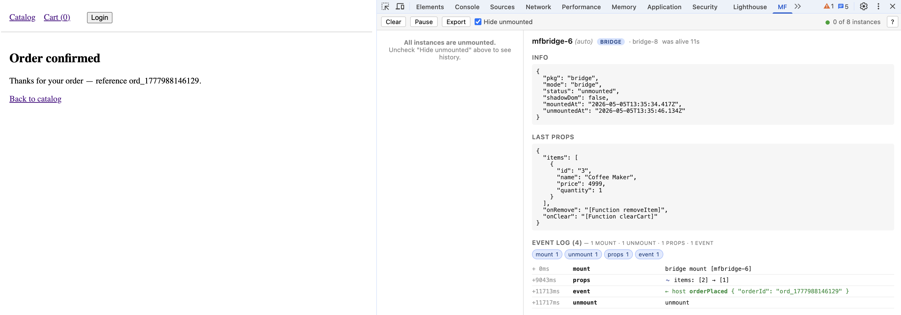
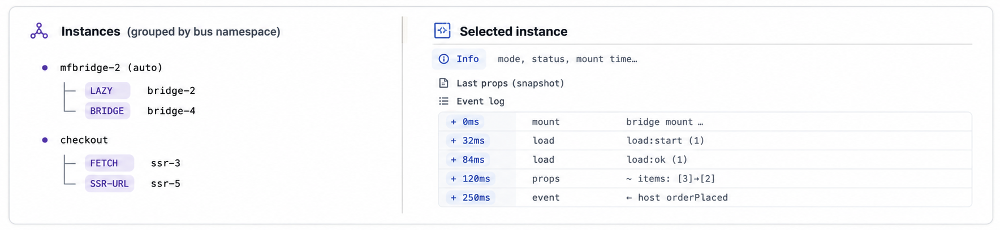
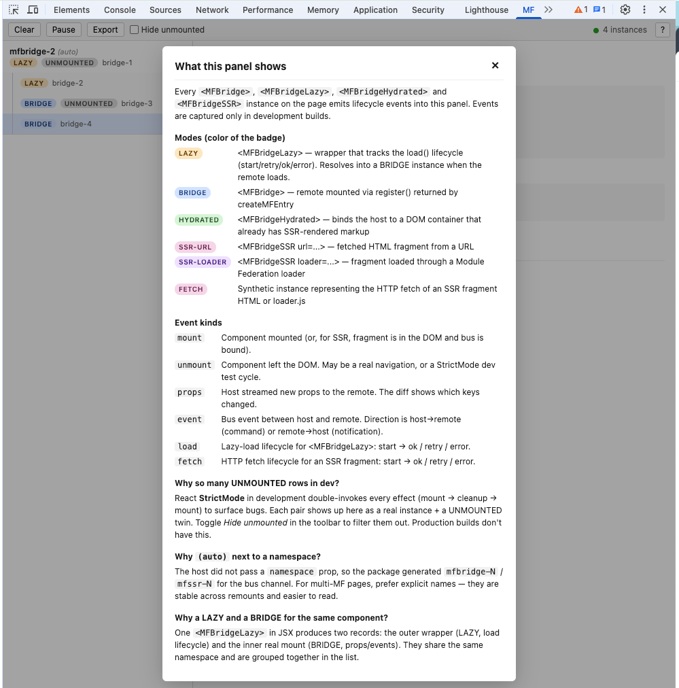
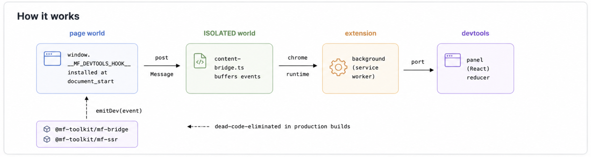

# `@mf-toolkit/mf-devtools`

[](https://github.com/zvitaly7/mf-toolkit/blob/main/LICENSE)
[](https://developer.chrome.com/docs/extensions/mv3/intro/)
[](https://react.dev)



**Chrome DevTools panel for Module Federation.** Two tabs:

- **Instances** — live inspection of [`@mf-toolkit/mf-bridge`](../mf-bridge) and [`@mf-toolkit/mf-ssr`](../mf-ssr): every mount, prop update, host↔remote bus event, lazy-load attempt, retry, and SSR fragment fetch with a full timeline, prop diffs, and a per-instance event log. Driven by the dev-only emit hook in `mf-bridge` / `mf-ssr`; zero production cost (call sites are dead-code-eliminated).
- **Shared Audit** — runs the [`@mf-toolkit/shared-inspector`](../shared-inspector) analyzer **in the browser** on Module Federation manifests discovered on the page. Auto-discovers MF 2.0 manifests via `window.__FEDERATION__` and `mf-manifest.json` network sniff; for classic Webpack 5 / 4 MF, upload a CLI-generated `project-manifest.json`. Surfaces version conflicts, singleton mismatches, ghost shares, deep-import bypass, eager risks, plus a risk score per project and across the federation. **Independent of `mf-bridge` / `mf-ssr`** — works on any Module Federation page.

> **This package is not published to npm.** It ships as a Chrome extension — load `dist/` unpacked for development, or install from the Chrome Web Store.

---

## The problem

You ship microfrontends with `mf-bridge` and `mf-ssr`. Once you have more than one on the page, runtime questions pile up fast:

- *Why did the cart fragment re-mount three times when I navigated?*
- *Are my props actually streaming to the remote, or is the host hoarding them?*
- *Did the lazy load retry, or is it stuck waiting for `import('checkout/entry')` that never resolves?*
- *Did the SSR fragment fetch fail silently, or did the host fall back to client render?*
- *Why is React's StrictMode dev cycle showing four instances when there's only one `<MFBridgeLazy>` in the JSX?*

Webpack stats and `console.log` don't answer these. React DevTools sees the host's tree, but doesn't model the bus channel between host and remote. Network panel shows fragment URLs but not which `<MFBridgeSSR>` triggered them.

## The solution

A purpose-built DevTools panel that subscribes to the same dev-only emitter that `mf-bridge` and `mf-ssr` already use, and renders it as a normalized model of every live (and recently unmounted) microfrontend instance.



For every instance the panel captures:

- **Mode** — `lazy`, `bridge`, `hydrated`, `ssr-url`, `ssr-loader`, `fetch` (color-coded badges).
- **Status** — `loading`, `mounted`, `unmounted`, `error`.
- **Lifetime** — `alive 12s` while live, `was alive 1m 23s` after unmount.
- **Last props** + **diff between consecutive `props` updates** (`+ added`, `− removed`, `~ changed`).
- **Bidirectional event log** — `→ remote` for host commands, `← host` for remote notifications.
- **Lazy-load lifecycle** — `start` → `retry` → `ok` / `error`, with attempt counters.
- **SSR fetch lifecycle** — fragment HTTP fetches with attempts and error messages.

## Instances tab

| Toolbar | What it does |
|---|---|
| **Clear** | Reset captured instances and event logs for the current tab. |
| **Pause / Resume** | Stop processing incoming events; events queue up and replay on resume. |
| **Export** | Download a JSON dump of all instances and their event logs (for bug reports). |
| **Hide unmounted** *(default on)* | Hide unmounted instances. Especially useful in dev — React StrictMode double-invokes effects, doubling the list with twin UNMOUNTED rows. |
| **Connection dot** | 🟢 connected · 🟡 reconnecting · 🔴 disconnected. MV3 service workers can be evicted after ~30s; the panel auto-reconnects and re-pulls buffered events. |
| **? (help)** | Cheat-sheet popover with the full mode + event-kind legend. |

| Detail pane | What it shows |
|---|---|
| Header | Namespace · mode badge · instance id · lifetime |
| **Info** | JSON snapshot — `pkg`, `mode`, `status`, `url`, `shadowDom`, `mountedAt`, `unmountedAt` |
| **Last props** | Most recent props the host streamed to the remote |
| **Event log** | All events on this instance, with per-kind filter chips and a count breakdown (`2 mount · 3 props · 1 event`). Each `props` row shows a diff against the previous snapshot |

### Grouped instances

A single `<MFBridgeLazy>` in JSX produces two records in the panel: the outer LAZY wrapper (load lifecycle) and the inner BRIDGE mount (props, events). They share a namespace and are rendered as parent → child:

```
mfbridge-2 (auto)
├── LAZY      bridge-2     ← outer wrapper, tracks load:start/retry/ok/error
└── BRIDGE    bridge-4     ← inner mount, tracks props + bus events
```

The same applies to StrictMode dev: each `mount → cleanup → mount` cycle produces a UNMOUNTED twin alongside the live row, all under one namespace group. Toggle **Hide unmounted** to filter them out.

### What does each badge mean?

The `?` button in the toolbar opens a cheat-sheet popover with the full legend — color of every mode badge, what every event `kind` means, why there can be a UNMOUNTED twin in dev, and why a single `<MFBridgeLazy>` produces two grouped records.



## Shared Audit tab

Runs the [`@mf-toolkit/shared-inspector`](../shared-inspector) analyzer in the browser on Module Federation manifests discovered on the page. **Independent of `mf-bridge` / `mf-ssr`** — works on any MF app, including federations you don't own as long as the runtime exposes manifests.

### How manifests are discovered

| Setup | What you do | What happens |
|---|---|---|
| **MF 2.0** (`@module-federation/enhanced`) | Open DevTools. | The page-world hook polls `window.__FEDERATION__` for ~15s after `document_start` and emits remote-entry hints. A network watcher (`chrome.devtools.network.onRequestFinished`) intercepts every `mf-manifest.json` fetch and pulls the body straight from the DevTools API — no extra HTTP. Both feed into the analyzer. |
| **Classic Webpack 5 / 4 MF** (no MF 2.0 runtime) | Generate a manifest with the CLI, upload it. | The original `ModuleFederationPlugin` doesn't expose anything to the browser. Run the inspector once per MF, then drop the resulting `project-manifest.json` into **Upload JSON…**. |
| **Mixed federation** | Open DevTools; upload classic ones manually. | MF 2.0 apps populate themselves; classic ones come in via upload. The federation analysis runs across the union. |

CLI command for the classic case:

```bash
npx mf-inspector \
  --source ./src \
  --shared shared-config.json \
  --name <mf-name> \
  --kind host \
  --write-manifest
```

> **CLI manifests give a deeper audit even on MF 2.0.** The runtime `mf-manifest.json` format only carries declarations (what's in `shared` / `remotes`); it has no usage data. Findings like *unused shared*, *share candidates*, and *deep-import bypass* only populate when the analyzer has the per-file imports the CLI manifest carries. Mix and match — auto-discover what you can, upload CLI manifests where you want the full picture.

### What it shows

| Section | Findings |
|---|---|
| **Federation audit** *(≥ 2 manifests loaded)* | Version conflicts, singleton mismatches, ghost shares, host gaps |
| **Per-project** *(one card per MF)* | Version mismatch (`requiredVersion` vs installed), singleton risks, eager risks, unused shared, share candidates, deep-import bypass |
| **Score** | `HEALTHY` / `GOOD` / `RISKY` / `CRITICAL`, computed per project and across the federation |

### Persistence and isolation

Loaded manifests are saved to `chrome.storage.local` keyed by **inspected origin**, so:

- Reload the page or close DevTools — manifests survive.
- Switch to a different site — independent audit set; nothing bleeds across origins.
- `localhost:3000` and `staging.example.com` keep separate piles.
- Click `×` on a card to drop one project.

### Privacy

The analyzer runs entirely in the panel. Nothing leaves the extension — no telemetry, no remote requests beyond fetching the manifests the page itself references. The only network traffic is `mf-manifest.json` retrieval; it uses extension `<all_urls>` host permissions, so CORS limitations of the inspected page do not apply.

### `?` help

The `?` button in the top-right of the Shared Audit tab opens an in-panel walkthrough — same content as this section, but at the user's fingertips.

## How it works



1. The extension's MAIN-world content script runs at `document_start` and installs `window.__MF_DEVTOOLS_HOOK__` **before** the user's bundle loads.
2. `mf-bridge` / `mf-ssr` call `emitDev(event)` at every relevant site — mount, unmount, propsChanged, event, command, load, fetch. The call is gated behind `process.env.NODE_ENV !== 'production'`, so the entire `_devtools.ts` module is dead-code-eliminated from production bundles.
3. The hook batches events with `queueMicrotask` and posts them to the ISOLATED-world content script via `window.postMessage`.
4. The content script forwards batches over `chrome.runtime.sendMessage` to the background service worker, which fans them to the open devtools panel via a long-lived `chrome.runtime.connect` port.
5. The panel's reducer normalises the event stream into instances + event logs, and renders them with React.
6. **Shared Audit pipeline (separate but reusing the same transport):** the same MAIN-world hook polls `window.__FEDERATION__` for ~15s and emits `kind: 'federation'` events with a digest of remote-entry hints. In the panel, `chrome.devtools.network.onRequestFinished` intercepts every `mf-manifest.json` fetch and reads the body straight from the DevTools API. Both feed into [`@mf-toolkit/shared-inspector`](../shared-inspector)'s browser-safe entrypoint (the `./browser` subpath export, which excludes Node-only modules like the file-system collector), where `analyzeProject` and `analyzeFederation` produce findings the panel renders as React. Manifests can also be uploaded manually for classic Webpack 5 / 4 MF.

### MV3 robustness

Manifest V3 service workers can be evicted after ~30s of inactivity even with a long-lived port. The panel handles this transparently:

- `port.onDisconnect` triggers an auto-reconnect with a small backoff.
- After reconnect, the panel re-pulls whatever the content script has buffered while the worker was down.
- The reducer dedupes identical events (same `kind + ts + id`), so the replayed buffer doesn't double up the event log.

You can see the connection state in the toolbar — 🟢 connected / 🟡 reconnecting / 🔴 disconnected.

## Hook protocol

The page-world hook contract is versioned and JSON-serializable:

```ts
window.__MF_DEVTOOLS_HOOK__ = { v: 1, emit(event: MFEvent): void }
```

See [`src/shared/protocol.ts`](./src/shared/protocol.ts) for the full event union.

## Install (development)

From the repo root:

```bash
npm install
npm run build --workspace=@mf-toolkit/mf-devtools
```

Then in Chrome:

1. Open `chrome://extensions`.
2. Enable **Developer mode** (top-right toggle).
3. Click **Load unpacked**.
4. Pick `packages/mf-devtools/dist`.
5. Open DevTools on any page — the **MF DevTools** tab appears unconditionally. Use **Instances** for `mf-bridge` / `mf-ssr` apps, or **Shared Audit** for any Module Federation app.

For watch-mode while iterating on the panel UI:

```bash
npm run dev --workspace=@mf-toolkit/mf-devtools
```

After every edit, click **Reload** on the extension card in `chrome://extensions`, then close and reopen DevTools.

## FAQ

**Q: Why so many UNMOUNTED rows in dev?**
React StrictMode in development double-invokes every effect (`mount → cleanup → mount`) to surface bugs. Each pair shows up as a real instance + a UNMOUNTED twin. Toggle **Hide unmounted** in the toolbar to filter them out. Production builds don't have this.

**Q: Why `(auto)` next to a namespace like `mfbridge-2`?**
The host did not pass an explicit `namespace` prop, so the package generated `mfbridge-N` / `mfssr-N` for the bus channel. For multi-MF pages, prefer explicit names — they're stable across remounts and read better in DevTools.

**Q: Why does one `<MFBridgeLazy>` produce two rows?**
The outer LAZY wrapper tracks the load lifecycle (`start`, `retry`, `ok`, `error`). Once the remote loads, an inner BRIDGE is rendered to do the actual mount and props/events. They share a namespace and are grouped together in the panel.

**Q: I see "Failed to fetch" but no `load:retry` / `load:error`.**
Webpack Module Federation does **not** reject `import('remote/entry')` when the remote server is unreachable — the promise just hangs. To get `load:retry` / `load:error`, pass an explicit `timeout` prop to `<MFBridgeLazy>`.

**Q: A `props` row says "re-emitted (reference change, no value diff)". What's wrong?**
The host re-rendered and passed a new props object/callback to the bridge — `mf-bridge` emitted `propsChanged` because the *reference* changed, but every key is structurally equal to the previous snapshot. Usually means the host is creating fresh inline callbacks every render. Wrap them in `useCallback` (or memoize the Context value) to remove the churn.

**Q: Production cost?**
Zero. The `emitDev` call sites are guarded by `if (process.env.NODE_ENV !== 'production')` and the entire `_devtools.ts` module is dead-code-eliminated by webpack/vite/esbuild in production builds.

**Q: Shared Audit shows "ghost share … used unshared by —" with an empty list. Bug?**
Not a bug — it's a format limitation. MF 2.0 `mf-manifest.json` only describes declarations (`shared`, `remotes`, `exposes`); it has no per-file usage data. So the analyzer can tell *what's declared* but not *where it's actually imported*. Findings that depend on usage data (`unused`, `share candidates`, `deep-import bypass`, the `usedUnsharedBy` list of ghost shares) only populate when you upload a `project-manifest.json` from the inspector CLI, which scans the source. Mix and match — auto-discovered manifests for the live picture, CLI manifests where you want full coverage.

**Q: Shared Audit can't see my federation, even though MF 2.0 is in use.**
Two common causes. (1) The page loaded all remotes *before* DevTools opened, so the network watcher missed every `mf-manifest.json` fetch — reload the page with DevTools open. The `__FEDERATION__` poller picks up most of these, but if your runtime doesn't expose `manifestUrl`/`remoteEntry` on its instances, manifests can't be located automatically. (2) Your app uses classic `ModuleFederationPlugin` without the MF 2.0 runtime — `__FEDERATION__` doesn't exist there. Generate a `project-manifest.json` with `npx mf-inspector --write-manifest` and upload it manually.

**Q: Does Shared Audit send my manifests anywhere?**
No. The analyzer is bundled into the panel and runs locally. The only network traffic is `mf-manifest.json` retrieval against URLs the page itself references, made from the extension context (so CORS doesn't apply). Nothing is sent to a server, and the loaded manifests are stored in `chrome.storage.local`.

**Q: Does Shared Audit need `mf-bridge` / `mf-ssr`?**
No. Shared Audit is independent of the runtime tab — it works on any Module Federation page (MF 2.0 with auto-discovery, classic MF with manual upload). The Instances tab is the one tied to `mf-bridge` / `mf-ssr`.
