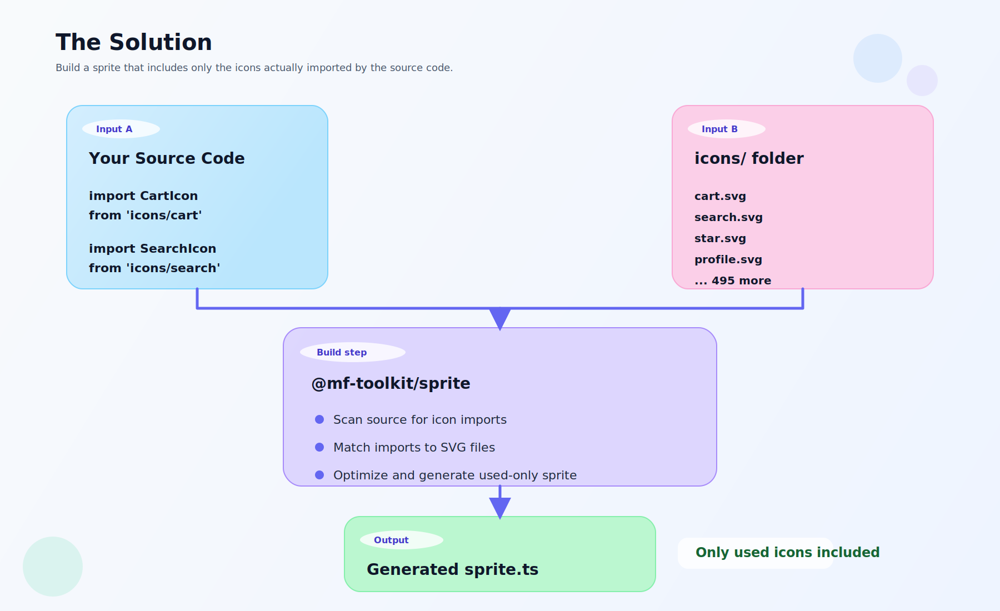

# @mf-toolkit/sprite-plugin

[](https://www.npmjs.com/package/@mf-toolkit/sprite-plugin)
[](https://nodejs.org)
[](https://github.com/zvitaly7/mf-toolkit/blob/main/packages/sprite-plugin/LICENSE)


> **Your monolith has 500 icons. Your microfrontend uses 12. Why ship all of them?**

Statically analyzes your source code, detects which icons are actually imported, and generates an optimized SVG sprite containing only those icons. Zero runtime overhead, zero manual configuration — just plug it into your build.

### Highlights

| | |
|---|---|
| **Zero parser dependencies** | Regex-based analyzer by default; optional AST parsers (TypeScript, Babel) |
| **17 KB** package size | Only one dependency: [SVGO](https://github.com/svg/svgo) for SVG optimization |
| **Smart matching** | PascalCase, kebab-case, digits, subdirectories — all resolved automatically |
| **Framework-agnostic** | Works with any bundler or standalone. Generated output is plain TypeScript |

## The Problem

When you split a monolith into microfrontends, each one inherits the full icon sprite — hundreds of SVG symbols your app never references. That's wasted bandwidth on every page load.

Manually maintaining per-app icon lists is error-prone and doesn't scale.

## The Solution



## Install

```bash
npm install @mf-toolkit/sprite-plugin --save-dev
```

## Quick Start

### With Webpack

```js
// webpack.config.js
const { MfSpriteWebpackPlugin } = require('@mf-toolkit/sprite-plugin/webpack');

module.exports = {
  plugins: [
    new MfSpriteWebpackPlugin({
      iconsDir: './src/assets/icons',
      sourceDirs: ['./src'],
      importPattern: /@my-ui\/icons\/(.+)/,
      output: './src/generated/sprite.ts',
    }),
  ],
};
```

### Without a Bundler

```js
// scripts/generate-sprite.mjs
import { generateSprite } from '@mf-toolkit/sprite-plugin';

await generateSprite({
  iconsDir: './src/assets/icons',
  sourceDirs: ['./src'],
  importPattern: /@my-ui\/icons\/(.+)/,
  output: './src/generated/sprite.ts',
});
```

Run it:

```bash
node scripts/generate-sprite.mjs
```

## Using the Generated Sprite

The plugin generates a TypeScript file with two exports:

```ts
// src/generated/sprite.ts (auto-generated, do not edit)

export function injectSprite(): void  // Inserts SVG sprite into the DOM
export const spriteIcons: readonly string[]  // List of included icon names
```

Call `injectSprite()` once at app startup:

```ts
// src/index.ts
import { injectSprite } from './generated/sprite';

injectSprite();
```

Then use icons via standard SVG `<use>` references:

```tsx
function CartButton() {
  return (
    <svg width="24" height="24">
      <use href="#cart" />
    </svg>
  );
}
```

The sprite is injected as a hidden `<div>` at the top of `<body>`. Icons inherit `color` from their parent via `currentColor` — no hardcoded colors.

## Configuration

### `importPattern` — How the Plugin Finds Your Icons

This is the most important option. It tells the plugin what an "icon import" looks like in your codebase.

The pattern is a regular expression applied to the **module specifier** (the string after `from` or inside `import()`). It must contain **one capture group** that extracts the icon name.

**Example:** If your imports look like this:

```ts
import { CartIcon } from '@my-ui/icons/cart';
//                        ^^^^^^^^^^^^^^^^^ module specifier
//                                          ^^^^ icon name (capture group)
```

Then your pattern is:

```js
importPattern: /@my-ui\/icons\/(.+)/
//                               ^^ captures "cart"
```

**More examples:**

```ts
// Flat imports: import Icon from 'icons/cart'
importPattern: /^icons\/(.+)/

// Scoped package: import X from '@company/icons/ui/cart'
importPattern: /@company\/icons\/(.+)/

// File-based: import X from './icons/cart.svg'
importPattern: /\.\/icons\/(.+)\.svg/
```

### `extractNamedImports` — Named Import Mode

Some codebases organize icons by category, with each category as a separate module:

```ts
import { Cart, Search } from '@ui/Icon/common';
import { ChevronRight } from '@ui/Icon/ui';
import { Arrow } from '@ui/Icon/payment';
```

In this pattern, the **icon name comes from the import specifier** (`Cart`, `Search`), not from the module path. Enable `extractNamedImports` to handle this:

```js
new MfSpriteWebpackPlugin({
  iconsDir: './src/assets/icons',
  sourceDirs: ['./src'],
  importPattern: /@ui\/Icon\/(.+)/,
  extractNamedImports: true,
  output: './src/generated/sprite.ts',
});
```

When `extractNamedImports` is enabled:
- The plugin extracts individual names from `{ Cart, Search }` instead of using the module path
- If `importPattern` has a **capture group**, the captured value is used as a **category prefix**: `Cart` from `@ui/Icon/common` becomes `common/Cart`
- This prefix allows disambiguating same-name icons in different subdirectories (e.g., `ui/arrow.svg` vs `payment/arrow.svg`)
- If the pattern has **no capture group**, icon names are used as-is without a prefix
- `type` imports are automatically excluded
- Aliases (`import { Cart as MyCart }`) use the original name (`Cart`), not the alias

### All Options

```ts
interface SpritePluginOptions {
  // Path to the folder containing source SVG files.
  // Scanned recursively — subdirectories are supported.
  iconsDir: string;

  // Folders to scan for icon usage in your source code.
  // node_modules, dist, build, .git are excluded automatically.
  sourceDirs: string[];

  // Regex to detect icon imports. Applied to the module specifier.
  // Must have one capture group for the icon name.
  importPattern: RegExp;

  // Where to write the generated sprite file.
  // Directory is created automatically if it doesn't exist.
  output: string;

  // Extract icon names from import specifiers instead of module paths.
  // When enabled, `import { Cart } from '@ui/icons/common'` extracts "Cart".
  // If importPattern has a capture group, it's used as a category prefix
  // (e.g., "common/Cart"). Default: false
  extractNamedImports?: boolean;

  // File extensions to scan. Default: ['.ts', '.tsx', '.js', '.jsx']
  extensions?: string[];

  // Print detailed logs during generation. Default: false
  verbose?: boolean;

  // Don't generate a file if no icons are found. Default: false
  skipIfEmpty?: boolean;

  // Generate sprite-manifest.json alongside the sprite file.
  // Useful for CI pipelines, debugging, and build reports. Default: false
  manifest?: boolean;

  // Parser strategy for analyzing imports.
  // 'regex' (default) — zero-dep, covers ~95% of patterns
  // 'typescript' — uses TypeScript Compiler API (requires `typescript`)
  // 'babel' — uses @babel/parser (requires `@babel/parser`)
  parser?: 'regex' | 'typescript' | 'babel';
}
```

### Icon Name Matching

The plugin matches icon names to SVG filenames in `iconsDir` using multiple strategies:

**Basic matching** (case-insensitive):
```
"cart"     → cart.svg
"CartIcon" → cart-icon.svg (PascalCase → kebab-case)
"Coupon2"  → coupon-2.svg  (letter + digit boundary)
```

**Path-based matching** (with `extractNamedImports` and a capture group):
```
icons/
├── ui/
│   └── arrow.svg      ← matched by "ui/Arrow"
├── payment/
│   └── arrow.svg      ← matched by "payment/Arrow"
├── cart.svg            ← matched by "cart"
└── search.svg          ← matched by "search"
```

When icons have the same filename in different subdirectories, the category prefix from the capture group disambiguates them. Each icon gets a unique symbol ID in the sprite (`id="ui/arrow"`, `id="payment/arrow"`).

**Without a prefix**, the plugin falls back to basename matching. If multiple files share the same name, the last one found wins — use prefixes to avoid ambiguity.

If an icon is imported but no matching SVG file exists, the plugin logs a warning and continues — it won't break your build.

## What Gets Optimized

Every SVG goes through [SVGO](https://github.com/svg/svgo) and additional processing:

| Before | After |
|--------|-------|
| Editor metadata (Figma, Sketch, Illustrator) | Removed |
| `width` and `height` attributes | Removed (uses `viewBox` instead) |
| XML namespaces, doctype, comments | Removed |
| `fill="#000000"`, `fill="#000"`, `fill="black"` | `fill="currentColor"` |
| `fill="rgb(0,0,0)"`, `rgba(0,0,0,1)` | `fill="currentColor"` |
| Colors inside `<style>` blocks | Also replaced with `currentColor` |
| Redundant groups, empty elements | Removed |
| Path data | Minified |

The `currentColor` replacement means your icons automatically inherit the text color of their parent element. Set `color: red` on the parent — the icon turns red.

## Import Styles Detected

The analyzer finds icons across all common import patterns:

```ts
// Static imports
import { CartIcon } from '@ui/icons/cart';
import CartIcon from '@ui/icons/cart';
import * as CartIcon from '@ui/icons/cart';

// Type imports (TypeScript) — ignored, not real usage
import type { CartIcon } from '@ui/icons/cart';

// Re-exports
export { CartIcon } from '@ui/icons/cart';

// Dynamic imports
const CartIcon = await import('@ui/icons/cart');
import('@ui/icons/cart').then(({ CartIcon }) => /* ... */);

// CommonJS
const CartIcon = require('@ui/icons/cart');

// Multiline
import {
  CartIcon,
  SearchIcon,
} from '@ui/icons/cart';
```

With `extractNamedImports: true`, the analyzer also extracts individual names from destructured imports:

```ts
// Each name becomes a separate icon
import { Cart, Search, Star } from '@ui/Icon/common';
// → icons: common/Cart, common/Search, common/Star

// Aliases use the original name
import { Cart as MyCart } from '@ui/Icon/common';
// → icon: common/Cart (not MyCart)

// Type imports are excluded
import { type CartProps, Cart } from '@ui/Icon/common';
// → icon: common/Cart (CartProps is skipped)

// Dynamic imports with .then() — member access (React.lazy pattern)
import('@ui/Icon/ui').then((m) => ({ default: m.ChevronRight }));
// → icon: ui/ChevronRight

// Dynamic imports with .then() — destructured
import('@ui/Icon/ui').then(({ ChevronRight, Cart }) => ...);
// → icons: ui/ChevronRight, ui/Cart

// Destructured await
const { ChevronRight, Cart } = await import('@ui/Icon/ui');
// → icons: ui/ChevronRight, ui/Cart
```

Imports inside comments (`//` and `/* */`) are correctly ignored.

## SSR Compatibility

The generated `injectSprite()` function is safe to call during server-side rendering — it checks for `document` before doing anything:

```ts
export function injectSprite(): void {
  if (injected || typeof document === 'undefined') return;
  // ...
}
```

Multiple calls are also safe — the sprite is injected only once.

## Build Manifest

Enable `manifest: true` to generate a `sprite-manifest.json` alongside the sprite file:

```js
await generateSprite({
  // ...
  manifest: true,
});
```

The manifest contains a machine-readable report of what was generated:

```json
{
  "generatedAt": "2025-03-25T12:00:00.000Z",
  "iconsCount": 34,
  "missingCount": 3,
  "icons": [
    { "name": "cart", "sources": ["src/components/Cart.tsx:5"] },
    { "name": "ui/arrow", "sources": ["src/components/Nav.tsx:2"] }
  ],
  "missing": ["PacmanLazy", "SplitLazy"]
}
```

Useful for CI pipelines (fail if too many icons are missing), build dashboards, and debugging why a particular icon is or isn't in the sprite.

## Unanalyzable Import Warnings

When using `extractNamedImports: true`, the plugin warns about import patterns that cannot be statically analyzed:

```
[sprite] Namespace import is not statically analyzable: import * as Icons from '@ui/Icon/ui'
  at src/components/App.tsx:3
  Refactor to named imports: import { Icon1, Icon2 } from '@ui/Icon/ui'

[sprite] Wildcard re-export is not statically analyzable: export * from '@ui/Icon/ui'
  at src/index.ts:5
  Refactor to named re-exports: export { Icon1, Icon2 } from '@ui/Icon/ui'
```

These warnings help you find and fix patterns that would cause icons to be silently excluded from the sprite.

> **Note:** Some libraries export lazy-loading wrappers (e.g., `PacmanLazy`) that don't correspond to actual SVG files. These will appear in the `missing` list — this is expected and safe to ignore.

## SVG ID Collision Protection

When multiple icons use the same internal IDs (common with design tool exports — e.g., `id="gradient1"`, `id="clip0"`), they would conflict inside a single sprite. The plugin automatically prefixes all internal IDs:

```xml
<!-- Before: two icons both use id="grad1" -->
<symbol id="cart"><circle fill="url(#grad1)" />...</symbol>
<symbol id="star"><rect fill="url(#grad1)" />...</symbol>

<!-- After: each icon gets a unique prefix -->
<symbol id="cart"><circle fill="url(#cart--grad1)" />...</symbol>
<symbol id="star"><rect fill="url(#star--grad1)" />...</symbol>
```

This applies to `id`, `url(#...)`, `href="#..."`, and `xlink:href="#..."` references.

## Programmatic API

For advanced use cases, the analyzer and generator can be used independently:

```ts
import { analyzeImports, generateSprite } from '@mf-toolkit/sprite-plugin';

// Step 1: Find which icons are used
const usages = await analyzeImports({
  sourceDirs: ['./src'],
  importPattern: /@ui\/Icon\/(.+)/,
  extractNamedImports: true,
});

console.log(`Found ${usages.length} icons:`);
for (const usage of usages) {
  console.log(`  ${usage.name} ← ${usage.source}:${usage.line}`);
}
// Output: common/Cart ← src/app.tsx:3
//         ui/Arrow    ← src/nav.tsx:1

// Step 2: Generate the sprite (or do something else with the list)
await generateSprite({
  iconsDir: './src/assets/icons',
  sourceDirs: ['./src'],
  importPattern: /@ui\/Icon\/(.+)/,
  extractNamedImports: true,
  output: './src/generated/sprite.ts',
  manifest: true,
  verbose: true,
});
```

## Parser Strategies

By default, the plugin uses a **regex-based analyzer** — zero dependencies, fast, covers the vast majority of real-world import patterns. If you need 100% syntactic accuracy, you can opt into an AST-based parser.

### `parser: 'regex'` (default)

No extra dependencies. Covers static imports, dynamic `import()`, `require()`, `.then()` destructuring, `React.lazy` patterns, and `await import()`.

| | Regex (default) | AST parsers |
|---|---|---|
| **Install size** | +0 (Node.js built-ins) | +5 MB (`@babel/parser`) or +0 if `typescript` already installed |
| **Accuracy** | ~95% of real-world patterns | 100% of syntax |
| **Speed** | Scan only import lines | Parse entire file |
| **Dependencies** | None | Optional peer dependency |

> **Tested against a production microfrontend with 319 available icons: identical results (38/38 matched) compared to a Babel-based analyzer, with zero additional dependencies.**

### `parser: 'typescript'`

Uses the TypeScript Compiler API (`ts.createSourceFile`) for full syntactic parsing. If you already have `typescript` in your project, this adds no extra install size.

```bash
npm install -D typescript
```

```js
new MfSpriteWebpackPlugin({
  // ...
  parser: 'typescript',
});
```

### `parser: 'babel'`

Uses `@babel/parser` for full syntactic parsing. Supports all JS/TS/JSX/TSX syntax including decorators.

```bash
npm install -D @babel/parser
```

```js
new MfSpriteWebpackPlugin({
  // ...
  parser: 'babel',
});
```

### Which parser to choose?

- **regex** — you don't need to install anything, and it works for the vast majority of codebases. Start here.
- **typescript** — if you already have `typescript` installed and want full accuracy at no extra cost.
- **babel** — if your codebase uses Babel-specific syntax or you prefer Babel's parser.

## License

MIT
